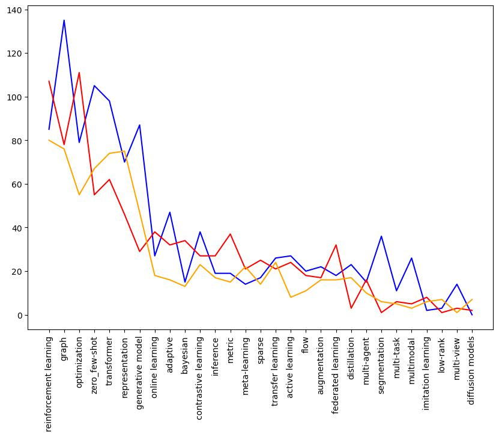
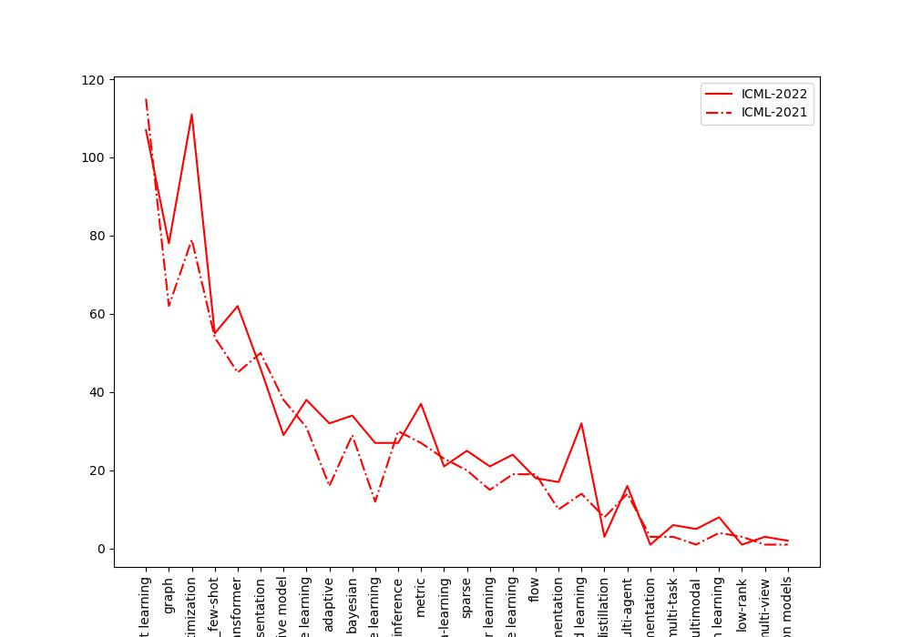
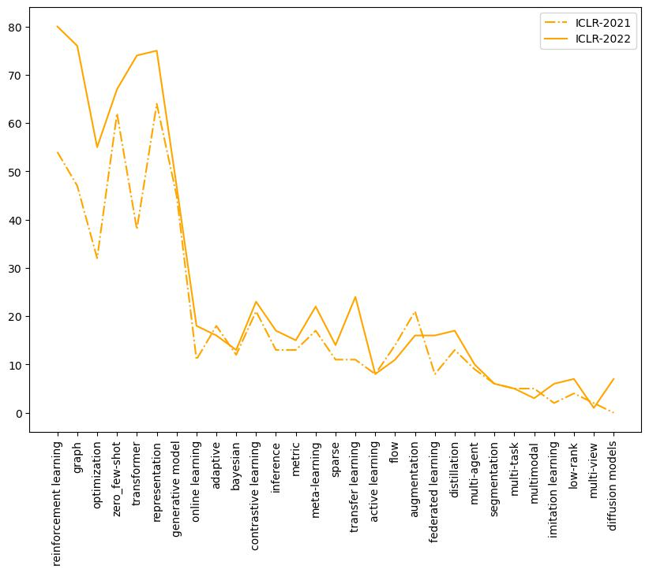

# AI-trends-in-conferences
Track the trends of hot topics in AI conferences.

Conferences included: ICML, ICLR, NIPS, AAAI.

### Summary of papers submitted of different topics:

### Comparison of papers published on ICML, AAAI, and ICLR on 2022

### Papers published on ICML in 2021 and 2022

### Papers published on ICLR in 2021 and 2022

License: [MIT license](./LICENSE)