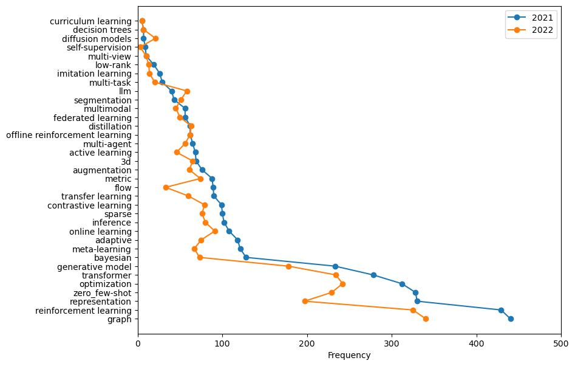

# AI-trends-in-conferences
Track the trends of hot topics in AI conferences.

Conferences included: ICML, ICLR, NIPS, AAAI.~~~~

### Summary of papers submitted of different topics:

License: [MIT license](./LICENSE)
